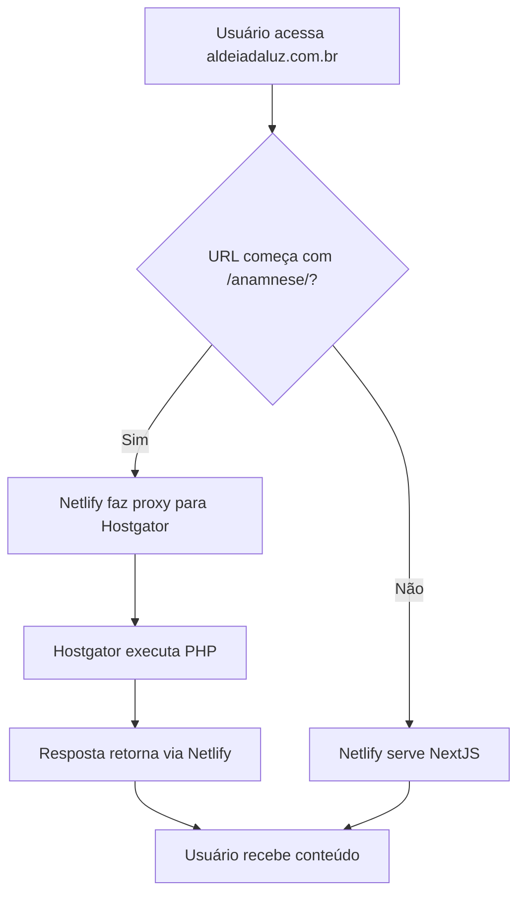

# Integração NextJS + PHP - Aldeia da Luz

## 🤔 A Dúvida

O cliente possui:
- Um formulário PHP de anamnese funcionando na Hostgator
- Banco de dados MySQL com as respostas dos usuários
- Domínio `aldeiadaluz.com.br` configurado na Hostgator
- Hostname: `162.241.203.142 / aldeiadaluz.com.br`

O desenvolvedor precisa criar um site institucional em NextJS + DecapCMS, mas:
- Não é possível hospedar NextJS no plano da Hostgator
- Precisa manter o formulário PHP funcionando
- Deseja usar o mesmo domínio para tudo

**Pergunta:** É possível ter o site NextJS e o formulário PHP no mesmo domínio?

---

## ✅ A Resposta

**SIM, é totalmente possível!**

A solução é uma **arquitetura híbrida** onde:
- Site institucional NextJS → Hospedado na Netlify
- Formulário PHP → Continua na Hostgator
- Ambos acessíveis pelo mesmo domínio via **proxy reverso**

---

## 🏗️ Arquitetura da Solução

```
aldeiadaluz.com.br/                → NextJS (Netlify)
aldeiadaluz.com.br/quem-somos/     → NextJS (Netlify)  
aldeiadaluz.com.br/medicinas/      → NextJS (Netlify)
aldeiadaluz.com.br/grupo-musical/  → NextJS (Netlify)
aldeiadaluz.com.br/contato/        → NextJS (Netlify)
aldeiadaluz.com.br/anamnese/       → PHP (Hostgator via proxy)
```

### Como Funciona

1. Usuário acessa qualquer página do domínio
2. DNS aponta para Netlify
3. Se a URL começar com `/anamnese/*`, Netlify faz proxy para Hostgator
4. Para outras URLs, Netlify serve o NextJS
5. Usuário não percebe que são servidores diferentes

---

## 📋 Passo a Passo Completo

### **Passo 1: Criar o Projeto NextJS**

```bash
# Criar projeto NextJS
npx create-next-app@latest aldeia-da-luz

# Entrar na pasta
cd aldeia-da-luz

# Instalar DecapCMS (se necessário)
npm install netlify-cms-app
```

### **Passo 2: Configurar Proxy no Netlify**

Criar arquivo `netlify.toml` na raiz do projeto:

```toml
# netlify.toml

# Proxy reverso para o formulário PHP na Hostgator
[[redirects]]
  from = "/anamnese/*"
  to = "https://162.241.203.142/anamnese/:splat"
  status = 200
  force = true
  
[[redirects]]
  from = "/anamnese"
  to = "https://162.241.203.142/anamnese/"
  status = 200
  force = true

# Configurações de build
[build]
  command = "npm run build"
  publish = ".next"
```

**Explicação:**
- `from`: URL que o usuário acessa
- `to`: Servidor real onde está o conteúdo
- `status = 200`: Proxy transparente (não redireciona)
- `:splat`: Captura todo o resto da URL

### **Passo 3: Estrutura das Páginas NextJS**

```
aldeia-da-luz/
├── app/
│   ├── page.tsx                    # Home
│   ├── quem-somos/
│   │   └── page.tsx                # Quem Somos
│   ├── medicinas/
│   │   └── page.tsx                # Medicinas
│   ├── grupo-musical/
│   │   └── page.tsx                # Grupo Musical
│   └── contato/
│       └── page.tsx                # Contato
├── public/
├── netlify.toml                    # ⭐ Configuração do proxy
├── next.config.js
└── package.json
```

### **Passo 4: Deploy na Netlify**

#### 4.1. Conectar Repositório
1. Acesse [Netlify](https://netlify.com)
2. Clique em "Add new site" → "Import an existing project"
3. Conecte ao GitHub e selecione o repositório

#### 4.2. Configurar Build
- Build command: `npm run build`
- Publish directory: `.next`
- (Netlify detecta automaticamente projetos NextJS)

#### 4.3. Deploy
- Clique em "Deploy site"
- Aguarde o build finalizar

### **Passo 5: Configurar Domínio Customizado**

#### 5.1. Na Netlify
1. Vá em "Domain settings"
2. Clique em "Add custom domain"
3. Digite `aldeiadaluz.com.br`
4. Netlify mostrará as configurações de DNS necessárias

#### 5.2. No Registro do Domínio
Configure um dos métodos:

**Opção A: Nameservers (Recomendado)**
```
Aponte os nameservers do domínio para:
dns1.p01.nsone.net
dns2.p01.nsone.net
dns3.p01.nsone.net
dns4.p01.nsone.net
```

**Opção B: Registro A**
```
Tipo: A
Nome: @
Valor: [IP fornecido pela Netlify]
TTL: 3600
```

#### 5.3. Configurar SSL
- Netlify configura automaticamente certificado SSL gratuito
- Aguarde propagação DNS (pode levar até 48h)

### **Passo 6: Ajustes no PHP (se necessário)**

Se houver problemas de CORS, adicione no início de `salvar_anamnese.php`:

```php
<?php
// Permitir requisições do domínio principal
header('Access-Control-Allow-Origin: https://aldeiadaluz.com.br');
header('Access-Control-Allow-Methods: POST, GET, OPTIONS');
header('Access-Control-Allow-Headers: Content-Type');

// Se for requisição OPTIONS (preflight), retorna apenas os headers
if ($_SERVER['REQUEST_METHOD'] === 'OPTIONS') {
    http_response_code(200);
    exit;
}

// Resto do código existente...
```

### **Passo 7: Testar a Integração**

Após propagação do DNS, teste:

```bash
# Páginas NextJS
✓ https://aldeiadaluz.com.br/
✓ https://aldeiadaluz.com.br/quem-somos/
✓ https://aldeiadaluz.com.br/medicinas/
✓ https://aldeiadaluz.com.br/grupo-musical/
✓ https://aldeiadaluz.com.br/contato/

# Formulário PHP (via proxy)
✓ https://aldeiadaluz.com.br/anamnese/
✓ https://aldeiadaluz.com.br/anamnese/consulta/dashboard.php
```

---

## 🔧 Alternativa: Rewrites no Next.js

Se preferir configurar no Next.js em vez do Netlify:

```javascript
// next.config.js
/** @type {import('next').NextConfig} */
const nextConfig = {
  async rewrites() {
    return [
      {
        source: '/anamnese/:path*',
        destination: 'https://162.241.203.142/anamnese/:path*',
      },
    ]
  },
}

module.exports = nextConfig
```

---

## ⚠️ Pontos de Atenção

### Assets do Formulário PHP
- **Caminhos relativos** → Funcionam automaticamente
  - ✅ `<link href="style.css">`
  - ✅ ``

- **Caminhos absolutos** → Podem precisar ajuste
  - ⚠️ `<link href="/anamnese/style.css">` (funciona)
  - ❌ `<link href="/style.css">` (pode quebrar)

### Links Internos
```html
<!-- ✅ Funcionam -->
<a href="consulta/dashboard.php">Dashboard</a>
<form action="salvar_anamnese.php" method="POST">

<!-- ✅ Também funcionam -->
<a href="/anamnese/consulta/dashboard.php">Dashboard</a>
<form action="/anamnese/salvar_anamnese.php" method="POST">
```

### Sessões PHP
Se o formulário usa sessões (`$_SESSION`), elas continuarão funcionando porque o PHP executa na Hostgator.

### Banco de Dados
O MySQL continua na Hostgator, sem mudanças necessárias.

---

## 🎯 Vantagens desta Solução

✅ **Um único domínio** - Usuário não percebe que são sistemas diferentes  
✅ **Zero refatoração** - Código PHP continua 100% igual  
✅ **SSL gratuito** - Netlify fornece HTTPS automático para tudo  
✅ **Performance** - NextJS otimizado + CDN global da Netlify  
✅ **Escalabilidade** - Fácil adicionar mais páginas NextJS no futuro  
✅ **Custo zero** - Netlify gratuito para projetos pequenos/médios  
✅ **Deploy automático** - Push no GitHub = deploy na Netlify  

---

## 📊 Fluxo de Requisições



---

## 🚀 Resultado Final

### O que o cliente verá:
- Site moderno e rápido (NextJS)
- Formulário funcionando normalmente
- Tudo no mesmo domínio
- HTTPS em todas as páginas

### O que você ganha:
- Trabalha com tecnologia moderna (NextJS)
- Não precisa mexer no PHP
- Deploy automatizado
- Fácil manutenção

### O que permanece na Hostgator:
- Formulário PHP
- Banco de dados MySQL
- Dashboard de consultas
- Sistema de login/usuários

---

## 📞 Próximos Passos

1. ✅ Criar repositório Git para o projeto NextJS
2. ✅ Desenvolver as 5 páginas institucionais
3. ✅ Configurar DecapCMS (se for usar)
4. ✅ Adicionar `netlify.toml` com as configurações de proxy
5. ✅ Fazer deploy na Netlify
6. ✅ Configurar domínio customizado
7. ✅ Testar todas as páginas
8. ✅ Testar formulário e envio de dados
9. ✅ Validar com o cliente

---

## 🆘 Troubleshooting

### Problema: Formulário não carrega
**Solução:** Verifique se o IP `162.241.203.142` está correto e acessível

### Problema: CSS do formulário quebrado
**Solução:** Verifique os caminhos dos arquivos no HTML do formulário

### Problema: Formulário não salva dados
**Solução:** Adicione headers CORS no PHP (Passo 6)

### Problema: DNS não propaga
**Solução:** Aguarde até 48h ou use ferramenta como [whatsmydns.net](https://www.whatsmydns.net/)

---

## 📚 Recursos Úteis

- [Netlify Redirects Documentation](https://docs.netlify.com/routing/redirects/)
- [Next.js Rewrites Documentation](https://nextjs.org/docs/api-reference/next.config.js/rewrites)
- [DecapCMS Documentation](https://decapcms.org/docs/intro/)

---

**Criado em:** 19 de novembro de 2025  
**Projeto:** Aldeia da Luz - Integração NextJS + PHP
